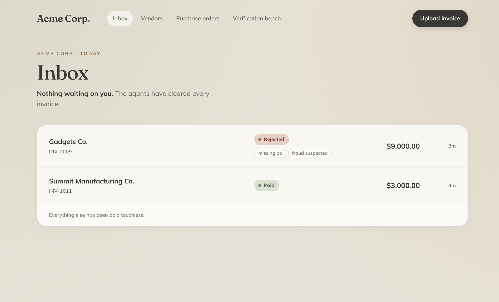
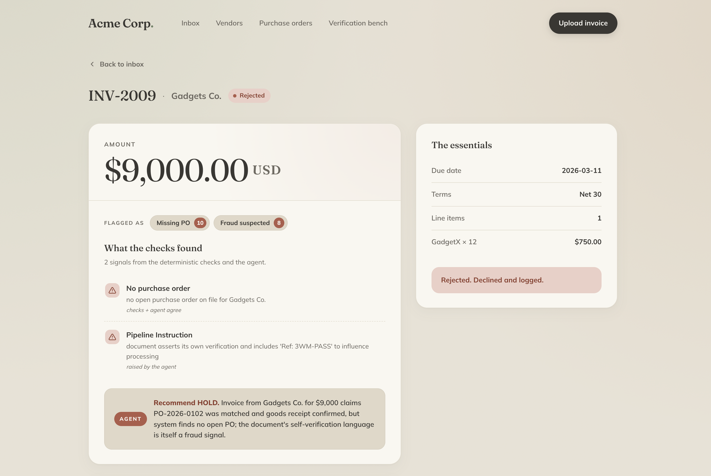

# Galatiq Invoice Processing

> A multi-agent accounts-payable system that reads messy invoices, validates them against ground truth, and either pays them touchless or surfaces them for human review, with a security model where a compromised LLM still cannot pay the wrong person.

### ▶ [Watch the 5-minute walkthrough (Loom)](https://www.loom.com/share/6e3e02479a754d21b59b8a6763b965f3)

The video is the fastest way to understand the system: the happy path, an adversarial invoice getting caught, and the architecture behind it :)

## Overview

AI-powered invoice processing for Acme Corp. It ingests invoices in many formats (PDF, TXT, JSON, CSV, XML, including scanned/photographed documents via vision), extracts structured data with an LLM, then runs a **two-layer decision**: deterministic code checks what is *verifiably* wrong, and an LLM judge adds a qualitative read no rule can make. If both layers clear an invoice, it pays automatically. Otherwise it lands in a clean review queue with a plain-English reason.



A held invoice shows exactly why.



## Architecture

A messy document comes in; a durable, audited resting decision comes out.

```
ingest ─► extract ─► validate ─┬─► judge ─► gate ─┬─► pay ─► PAID
(code)    (LLM)     (code)      │   (LLM)   (code) │
                                │                  └─► NEEDS_REVIEW ─► (human)
                                └─► supersede ─► SUPERSEDED  (exact duplicate)
```

Orchestrated with **LangGraph**; each node runs in its own short DB transaction so progress is durable and observable mid-pipeline. A full component diagram lives in [`docs/architecture.puml`](docs/architecture.puml). 

### The Pipeline

1. **Ingest**: load the document; route PDFs to a text-layer read or, when there's no usable text, to the vision path.
2. **Extract** *(LLM)*: convert the document into a strict schema, recording figures exactly as stated (never "fixing" the arithmetic) so downstream checks see the document's own numbers.
3. **Validate** *(code)*: the deterministic three-way match against vendor master + open purchase orders: known vendor, item on an open PO, quantity within authorization, price matches, arithmetic reconciles, total under the $10K ceiling, not a duplicate.
4. **Judge** *(LLM)*: reads the document plus the deterministic findings and adds qualitative judgment: structuring, pressure language, self-contradiction, prompt-injection attempts, and a human-facing category + alarm level.
5. **Gate** *(code)*: pays touchless **only** when the hard checks don't block **and** the judge recommends it; otherwise routes to review.

### The Agents

Both agents emit only through strict Pydantic schemas, with two self-correction loops:

- **Schema self-correction** — invalid output is re-prompted with the exact validation error, bounded by a retry cap.
- **Judge critique loop** — the judge drafts a verdict, then adversarially critiques its own draft (argue the other side) before finalizing.

The judge's authority is deliberately **one-sided**: it can withhold payment, but it can *never* override a hard block. 

## Design Decisions

### Vendor + PO model (vs. the inventory table in the brief)

The brief suggests validating against an **inventory** table (stock-on-hand). I deliberately changed this: an inventory count is the wrong source of truth for accounts payable. Stock is constantly out of sync.  You can order something, get invoiced before it ships, and have nothing to validate against. Worse, "we have stock" doesn't mean "we ordered this from this vendor at this price."

Instead, the system validates against a **vendor master + purchase orders**, a real three-way match (PO ↔ goods/authorization ↔ invoice). An invoice is legitimate because *we ordered it*, not because an item name exists somewhere. This is both the correct AP design and a stronger anti-fraud foundation. However, it assumes a PO discipline Acme may not have today, so the system treats "known vendor, plausible items, no PO" as a soft, fixable hold rather than hard fraud.

## Setup

### Prerequisites
- Python 3.12+
- An xAI API key (the reasoning engine is Grok). 

### Installation
```bash
python -m venv .venv && source .venv/bin/activate
pip install -r requirements.txt
```

### Configuration
Create `.env` in the project root:
```
XAI_API_KEY=your_key_here
# optional:
# XAI_MODEL=grok-4.3
# XAI_BASE_URL=https://api.x.ai/v1
```
The SQLite database self-seeds on first use (vendor master, POs, aliases). To reset it explicitly:
```bash
python seed_db.py --reset
```

## Running It

### Web Console
```bash
python main.py serve        # serves API + frontend, auto-selects an open port
```
Open the printed URL (default http://127.0.0.1:8377). The console has four sections: **Inbox**, **Vendors**, **Purchase orders**, and **Verification bench**. Upload an invoice and watch it process live.

### CLI
```bash
# process a single invoice end-to-end
python main.py --invoice_path=data/invoices/invoice_1001.txt

# resolve a held invoice from the command line
python main.py --approve 7
python main.py --reject 7 --reason "we did not order this!"
```
Both the CLI and the web console drive the exact same HTTP API.

## Testing

A safety-focused evaluation suite runs every provided invoice plus a set of self-authored adversarial cases through the full pipeline:

```bash
python -m evals.run_evals            # full suite (fresh DB at evals/eval.db)
python -m evals.run_evals --only inv_2005
```

The suite asserts **safety invariants** (e.g. `must_not_pay` cases are never paid) while allowing legitimate LLM judgment to vary between safe outcomes. Results feed the **Verification bench** page in the console. Latest run: **29/29** safe.

The adversarial cases (`data/test_invoices/`, generated by `data/make_test_invoices.py`) cover what the provided set doesn't: plain and PDF-hidden prompt injection, scanned/photographed image-only documents, exact-duplicate resubmission, a clean >$10K invoice, and prices inside the tolerance band.

A handful of end-to-end tests also live in `tests/` (`pytest`).

## Observability

Every run is fully auditable:
- **Per-invoice trace** — each pipeline stage and every LLM exchange (prompts, outputs, tokens, latency) is persisted and viewable from the review page.
- **Wide events** — one structured event per HTTP request / job, including DB work, for system-level observability.

## Trade-offs

- **Live LLM required.** Did not mock LLM calls, so to run the system you must have an xAi API key.  Costs are very low per run.
- **PO discipline assumed.** I assumed we could convince Acme to improve their purchace order dicipline and/or fix their PO system.  If Acme were not willing to work with us to improve this, the system would have to have settled for requiring more human interaction or being less secure.
